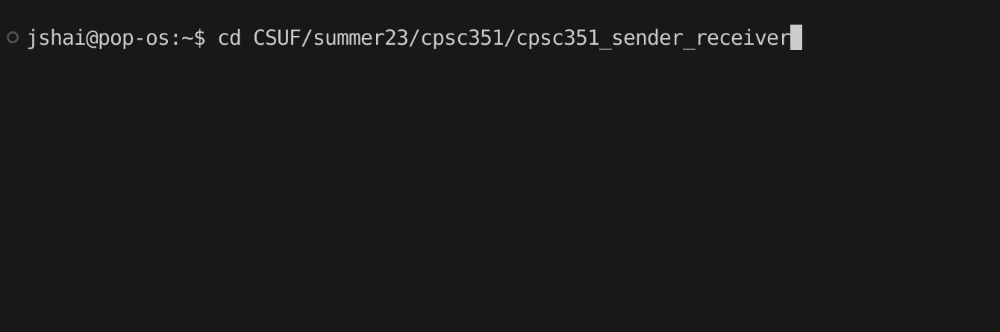
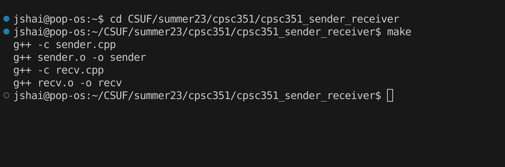
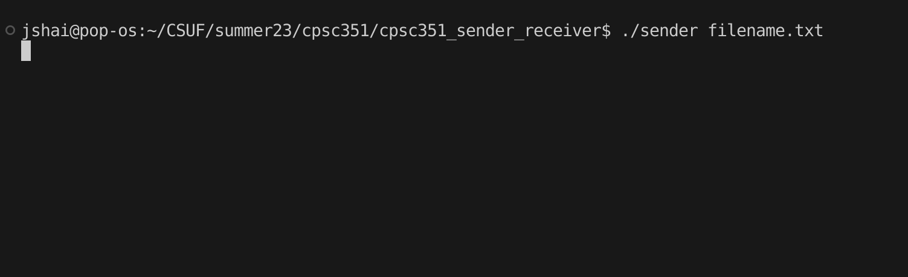
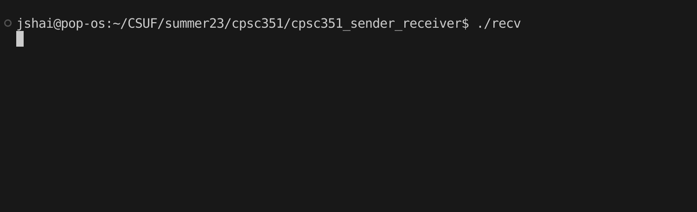

Team Members: 
- Michael Yu (Email: michaelyu31@csu.fullerton.edu)
- Jesse Shaihor (Email: Jcshaihor@csu.fullerton.edu)

Section: 11253

Programming Language: C++

Execution Steps:
1. Open the terminal and navigate to the directory where the code files are located.

2. Run the command "make" to compile the code.

3. Execute the command "./sender filename.txt" to run the sender program, where "filename.txt" is the name of the input file.

4. In a separate terminal window, navigate to the same directory.

5. Execute the command "./recv" to run the receiver program.

6. Follow the output or prompts to interact with the program.

Notes:
- This program is written in C++ and uses the message queue and shared memory mechanisms for interprocess communication.
- The sender program sends the contents of the "filename.txt" file to the receiver program.
- Make sure to provide the correct input file name when running the sender program.
- Collaboratively, Michael Yu worked on the sender, and Jesse Shaihor worked on the receiver.